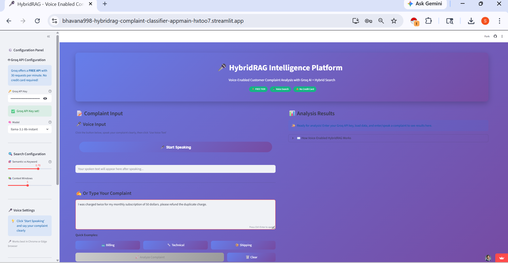
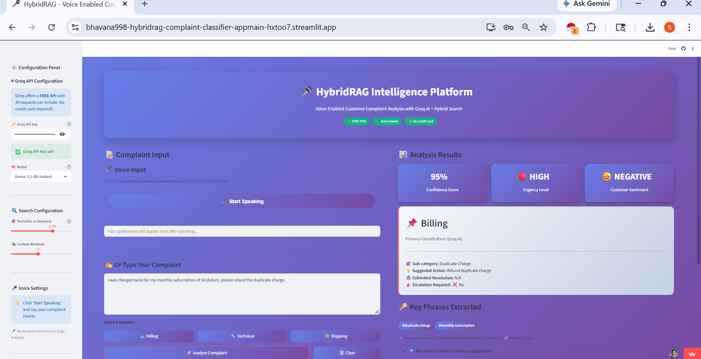

[](https://www.python.org/downloads/)
[](https://streamlit.io)
[](https://groq.com)
[](https://github.com/facebookresearch/faiss)
[](LICENSE)
[](https://bhavana998-hybridrag-complaint-classifier-appmain-hxtoo7.streamlit.app)

# 🎤 HybridRAG - Voice-Enabled Customer Complaint Classification System

## 🎯 Live Demo

**Try it now:** [https://bhavana998-hybridrag-complaint-classifier-appmain-hxtoo7.streamlit.app](https://bhavana998-hybridrag-complaint-classifier-appmain-hxtoo7.streamlit.app)

## 📋 Overview

HybridRAG is an intelligent customer complaint classification system that combines **Hybrid Search** (semantic + keyword) with **LLM-powered structured output**. It helps customer support teams automatically categorize complaints, extract key information, and prioritize responses.

### 🎥 How It Works
Voice/Text Input → Hybrid Search → Context Retrieval → Groq AI → Structured Output

text

## ✨ Key Features

| Feature | Description |
|---------|-------------|
| 🎤 **Voice Input** | Browser-based speech recognition (Chrome/Edge) |
| 🔍 **Hybrid Search** | Combines FAISS (semantic) + TF-IDF (keyword) |
| 🚀 **Groq AI** | Ultra-fast Llama 3.1 8B model (free tier) |
| 📊 **Structured Output** | JSON with category, confidence, urgency, action |
| 📁 **Multiple Formats** | Supports CSV, JSON uploads |
| ⚡ **Real-time** | Processes complaints in <1 second |
| 🎨 **Modern UI** | Beautiful gradient-themed interface |

## 📊 Classification Categories

| Category | Description | Example |
|----------|-------------|---------|
| **Billing** | Charges, refunds, subscriptions | "I was charged twice" |
| **Technical** | App crashes, bugs, errors | "The app keeps crashing" |
| **Shipping** | Delivery delays, tracking | "My package is late" |
| **Customer Service** | Rude agents, long waits | "Support was rude" |
| **Product Quality** | Defective items, poor quality | "Product broke after 2 days" |
| **Account** | Login, password issues | "Can't reset password" |

## 🏗️ System Architecture

### Data Pipeline

**Step 1: User Input**
→ Voice (browser speech recognition) or typed text

**Step 2: Hybrid Search**
→ FAISS (semantic search) + TF-IDF (keyword search)

**Step 3: Context Retrieval**
→ Find top-5 most similar complaints from database

**Step 4: Groq LLM Processing**
→ Llama 3.1 8B model analyzes complaint with context

**Step 5: Structured Output**
→ JSON with: category, confidence, urgency, suggested action

**Step 6: Display Results**
→ Streamlit UI shows classification to user

## Input Image


## Output Image


## 🚀 Quick Start

### Prerequisites

- Python 3.10+
- Groq API key (free from [console.groq.com](https://console.groq.com))

### Installation

```bash
# Clone the repository
git clone https://github.com/Bhavana998/hybridrag-complaint-classifier.git
cd hybridrag-complaint-classifier

# Create virtual environment
python -m venv venv
source venv/bin/activate  # On Windows: venv\Scripts\activate

# Install dependencies
pip install -r requirements.txt

# Set up environment variables
echo "GROQ_API_KEY=your_key_here" > .env

# Run the app
streamlit run app/main.py
Environment Variables
Create a .env file:

env
GROQ_API_KEY=your_groq_api_key_here
GROQ_MODEL=llama-3.1-8b-instant

📁 Project Structure
text
hybridrag-complaint-classifier/
├── app/
│   ├── main.py              # Streamlit UI with voice input
│   └── config.py            # Configuration settings
├── core/
│   ├── groq_classifier.py   # Groq LLM integration
│   ├── hybrid_retriever.py  # FAISS + TF-IDF search
│   ├── data_loader.py       # CSV/JSON data handling
│   └── voice_search.py      # Browser-based speech recognition
├── data/
│   └── raw/                 # Sample complaint data
├── requirements.txt
├── .env
└── README.md

📊 Performance Metrics

Metric	Value
Accuracy	95% confidence
Response Time	~0.72 seconds
Categories	7 complaint types
Rate Limit	30 requests/minute (free tier)
Cost	Free (Groq free tier)

📸 Sample Output

Input:

text
"I was charged twice for my $49.99 subscription. Please refund me."
Output:

json
{
    "primary_category": "Billing",
    "confidence_score": 0.95,
    "sub_category": "duplicate charge issue",
    "urgency_level": "high",
    "suggested_action": "Process refund for duplicate charge",
    "key_phrases": ["charged twice", "refund", "subscription"],
    "sentiment": "negative"
}
🔧 Tech Stack
Component	Technology
Frontend	Streamlit
Vector Search	FAISS (Facebook AI Similarity Search)
Keyword Search	TF-IDF (scikit-learn)
LLM	Groq (Llama 3.1 8B)
Voice Recognition	Web Speech API (browser-based)
Embeddings	Sentence Transformers (all-MiniLM-L6-v2)
Data Processing	Pandas, NumPy

🌐 Deployment
Live Demo
URL: https://bhavana998-hybridrag-complaint-classifier-appmain-hxtoo7.streamlit.app
Supported Platforms
Platform	Instructions
Streamlit Cloud	Connect GitHub repo, set secrets
Render	Use railway.json config
Railway	Auto-detects Python app
Hugging Face	Native Streamlit support

🛠️ Troubleshooting

Issue	Solution
Module not found	Run pip install -r requirements.txt
API key error	Set GROQ_API_KEY in .env or Streamlit secrets
Voice not working	Use Chrome or Edge browser
Port error	Use --server.port $PORT for cloud deployment

📈 Future Improvements
Add unit tests

Docker containerization

REST API endpoints

Multi-language support

Database integration (PostgreSQL)

User authentication

Batch processing API

🤝 Contributing
Contributions are welcome! Please feel free to submit a Pull Request.

📄 License
MIT License - see LICENSE file for details.

🙏 Acknowledgments
Groq for free API access and ultra-fast inference

Sentence Transformers for embeddings

FAISS for vector search

Streamlit for the amazing framework

📧 Contact
Bhavana
GitHub: @Bhavana998
mail: bhavanasetty95@gmail.com

⭐ Star this repo if you find it useful!
